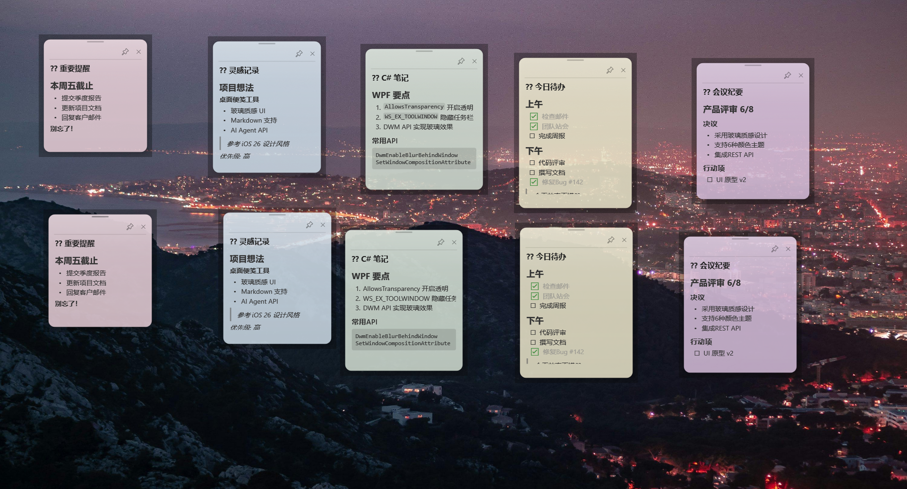

# 🗒️ DesktopMemo - 桌面便笺工具

一款具有 iOS 26 玻璃质感的 Windows 桌面便笺工具，支持 Markdown 渲染、多便笺管理、AI Agent API 接口。


## 📸 截图



## ✨ 功能特性

- **🪟 玻璃质感 UI** — 自动适配 Win7(DWM Blur)/Win10(Acrylic)/Win11(Mica) 原生玻璃效果
- **📝 Markdown 渲染** — 支持标题、加粗、斜体、列表、任务清单、代码块、引用、链接等
- **🎨 颜色分类** — 6 种颜色主题（黄/蓝/绿/粉/紫/灰），便于分类管理
- **🖱️ 防误触拖拽** — 专用拖拽手柄区域，不会因点击内容而意外移动
- **📐 自由缩放** — 编辑模式下可拖拽调整便笺大小
- **📌 置顶功能** — 可选让便笺始终显示在最前面
- **🤖 AI Agent API** — HTTP REST API 接口，支持 Hermes Agent、OpenClaw 等各类 AI Agent 调用
- **💾 便携免安装** — 单文件夹运行，数据存储在同级 `data/` 目录
- **⌨️ 快捷键支持** — `Ctrl+E` 编辑、`Ctrl+Delete` 删除（二次确认）、`Esc` 退出编辑
- **🖥️ 系统托盘** — 右键托盘图标管理便笺，支持显示/隐藏全部

## 📦 快速开始

### 下载

前往 [GitHub Releases](../../releases) 页面下载最新版本的 `DesktopMemo-vX.X.X.zip`。

### 运行

1. 解压 zip 文件到任意目录
2. 双击 `DesktopMemo.exe` 即可启动，无需安装

> **系统要求**: Windows 7 SP1 / 10 / 11
> - **Win10 / Win11**: 已内置 .NET Framework 4.8，解压即用
> - **Win7**: 需先安装 [.NET Framework 4.8 Runtime](https://dotnet.microsoft.com/download/dotnet-framework/net48)

### 目录结构

```
DesktopMemo/
├── DesktopMemo.exe          # 主程序
├── DesktopMemo.exe.config   # 配置文件
├── Markdig.dll              # Markdown 解析库
├── Newtonsoft.Json.dll      # JSON 序列化库
├── System.*.dll             # .NET 依赖
├── Resources/
│   └── tray.ico             # 托盘图标
└── data/                    # 运行时自动创建
    ├── notes.json           # 便笺数据
    └── settings.json        # 应用设置
```

## ⌨️ 键盘快捷键速查

| 快捷键 | 作用 | 场景 |
|--------|------|------|
| `Ctrl + E` | 切换编辑模式 | 查看 ↔ 编辑之间切换 |
| `Ctrl + Delete` | 删除便笺 | 弹出二次确认对话框 |
| `Esc` | 退出编辑 | 保存并退出编辑模式 |
| `双击` 便笺 | 进入编辑 | 鼠标双击标题或内容区域 |

> **设计原则**：
> - ✕ 按钮 = 隐藏（数据保留），可从托盘菜单恢复
> - `Ctrl+Delete` = 真正删除（需二次确认）
> - 这样设计是为了防止误操作导致数据丢失

## 🎮 操作指南

### 基本操作

| 操作 | 方法 |
|------|------|
| 新建便笺 | 托盘图标右键 → "新建便笺"，或双击托盘图标 |
| 移动便笺 | 拖拽顶部手柄条（8px 高度区域） |
| 隐藏便笺 | 点击 ✕ 按钮（数据保留，可从托盘"显示全部"恢复） |
| 显示全部 | 托盘图标右键 → "显示全部便笺" |
| 隐藏全部 | 托盘图标右键 → "隐藏全部便笺" |
| 调整大小 | 编辑模式下拖拽右下角缩放手柄 |
| 置顶便笺 | 点击 📌 图标切换 |
| 切换颜色 | 编辑模式下点击顶部颜色圆点 |

### ⌨️ 快捷键

| 快捷键 | 操作 | 说明 |
|--------|------|------|
| `Ctrl + E` | 进入/退出编辑 | 在查看模式和编辑模式之间切换 |
| `Ctrl + Delete` | 删除便笺 | 弹出确认对话框，确认后才真正删除数据 |
| `Esc` | 退出编辑 | 保存当前编辑内容并退出编辑模式 |
| `双击` | 进入编辑 | 双击便笺任意位置（标题/内容/拖拽条）进入编辑 |

> **提示**：`Ctrl+Delete` 会弹出确认对话框防止误删，而点击 ✕ 按钮仅隐藏便笺，不会删除数据。

### 编辑模式

进入编辑模式后：
- 标题变为可输入文本框
- 内容切换为 Markdown 源码编辑器
- 左上角显示颜色选择面板
- 右下角显示缩放手柄
- 底部显示 "✏ 编辑中" 提示
- 便笺背景变为不透明，确保阅读清晰

编辑内容会在停止输入 1 秒后自动保存。点击便笺外部区域或按 `Esc` 退出编辑。

## 📝 Markdown 语法

便笺内容支持以下 Markdown 语法：

```markdown
# 一级标题
## 二级标题
### 三级标题

**加粗文本** 和 *斜体文本*

- 无序列表项
- 另一项

1. 有序列表
2. 第二项

- [x] 已完成的任务
- [ ] 未完成的任务

> 引用文本

`行内代码`

代码块:
```
var note = new Note();
```

[链接文本](https://example.com)

---
```

## 🤖 AI Agent API

DesktopMemo 内置 HTTP REST API 服务器，默认监听 `http://localhost:19527`。
任何支持 HTTP 请求的 AI Agent 都可以通过此接口管理便笺。

### API 端点

| 方法 | 路径 | 说明 |
|------|------|------|
| `GET` | `/api/health` | 健康检查 |
| `GET` | `/api/notes` | 获取所有便笺 |
| `GET` | `/api/notes/{id}` | 获取单个便笺 |
| `POST` | `/api/notes` | 创建新便笺 |
| `PUT` | `/api/notes/{id}` | 更新便笺（部分更新） |
| `DELETE` | `/api/notes/{id}` | 删除便笺 |

### 请求示例

#### 创建便笺

```bash
curl -X POST http://localhost:19527/api/notes \
  -H "Content-Type: application/json" \
  -d '{
    "title": "待办事项",
    "content": "## 今日任务\n- [x] 写文档\n- [ ] 测试API",
    "color": "blue"
  }'
```

**响应:**

```json
{
  "id": "550e8400-e29b-41d4-a716-446655440000",
  "title": "待办事项",
  "content": "## 今日任务\n- [x] 写文档\n- [ ] 测试API",
  "color": "blue",
  "x": 1200,
  "y": 100,
  "width": 280,
  "height": 320,
  "alwaysOnTop": false,
  "visible": true,
  "createdAt": "2026-06-05T10:00:00Z",
  "updatedAt": "2026-06-05T10:00:00Z"
}
```

#### 更新便笺（部分更新）

```bash
curl -X PUT http://localhost:19527/api/notes/{id} \
  -H "Content-Type: application/json" \
  -d '{"title": "已更新的标题", "color": "green"}'
```

> 只需传入需要更新的字段，未传入的字段保持不变。

#### 删除便笺

```bash
curl -X DELETE http://localhost:19527/api/notes/{id}
```

#### 获取所有便笺

```bash
curl http://localhost:19527/api/notes
```

### 数据模型

```typescript
interface Note {
  id: string;          // GUID
  title: string;       // 标题
  content: string;     // Markdown 内容
  color: string;       // 颜色: yellow | blue | green | pink | purple | gray
  x: number;           // 窗口 X 坐标
  y: number;           // 窗口 Y 坐标
  width: number;       // 宽度（默认 280）
  height: number;      // 高度（默认 320）
  alwaysOnTop: boolean; // 是否置顶
  visible: boolean;     // 是否可见
  createdAt: string;   // 创建时间 (ISO 8601)
  updatedAt: string;   // 更新时间 (ISO 8601)
}
```

### AI Agent 集成示例

#### Hermes Agent

```yaml
# MCP server 配置
tools:
  - name: memo_create
    type: http
    url: http://localhost:19527/api/notes
    method: POST
  - name: memo_list
    type: http
    url: http://localhost:19527/api/notes
    method: GET
  - name: memo_update
    type: http
    url: http://localhost:19527/api/notes/{id}
    method: PUT
```

#### OpenClaw

```python
import requests

# 创建便笺
response = requests.post("http://localhost:19527/api/notes", json={
    "title": "AI 记录",
    "content": "这是由 AI Agent 自动创建的便笺",
    "color": "purple"
})
note = response.json()

# 更新便笺
requests.put(f"http://localhost:19527/api/notes/{note['id']}", json={
    "content": "更新后的内容"
})
```

## 🎨 颜色主题

| 名称 | 色调 | 建议用途 |
|------|------|---------|
| `yellow` | 暖黄 | 默认/提醒事项 |
| `blue` | 天蓝 | 信息/笔记 |
| `green` | 薄荷绿 | 已完成/成功 |
| `pink` | 粉色 | 重要/紧急 |
| `purple` | 紫色 | 创意/灵感 |
| `gray` | 灰色 | 归档/参考 |

## ⚙️ 配置

设置文件位于 `data/settings.json`：

```json
{
  "apiPort": 19527,
  "defaultColor": "yellow",
  "autoStart": false,
  "blurIntensity": 80,
  "fontSize": 14
}
```

| 配置项 | 说明 | 默认值 |
|--------|------|--------|
| `apiPort` | API 服务端口 | 19527 |
| `defaultColor` | 新便笺默认颜色 | yellow |
| `autoStart` | 开机自启（预留） | false |
| `blurIntensity` | 玻璃模糊强度 | 80 |
| `fontSize` | 基础字号 | 14 |

## 🏗️ 从源码构建

### 前置要求

- [.NET SDK 8.0+](https://dotnet.microsoft.com/download)（或更高版本）
- Windows 操作系统

### 构建步骤

```bash
# 克隆项目
git clone <repo-url>
cd DesktopMemo

# 还原依赖
dotnet restore DesktopMemo/DesktopMemo.csproj

# 编译
dotnet build DesktopMemo/DesktopMemo.csproj -c Release

# 发布
dotnet publish DesktopMemo/DesktopMemo.csproj -c Release -o ./publish
```

## 📋 技术栈

| 组件 | 技术 |
|------|------|
| UI 框架 | WPF (.NET Framework 4.8) |
| 玻璃效果 | DWM API / SetWindowCompositionAttribute |
| Markdown | Markdig |
| JSON | Newtonsoft.Json |
| HTTP 服务 | System.Net.HttpListener |
| 系统托盘 | System.Windows.Forms.NotifyIcon |

## ❓ FAQ

**Q: 点击 ✕ 按钮后便笺去哪了？**
A: ✕ 按钮仅隐藏便笺，数据保留在 `data/notes.json` 中。右键托盘图标 → "显示全部便笺"即可恢复。重启应用后所有便笺也会自动显示。

**Q: 如何真正删除便笺？**
A: 点击便笺后按 `Ctrl+Delete`，在弹出的确认对话框中选择"是"。

**Q: Win7 上玻璃效果不生效？**
A: 需要启用 Aero 主题（DWM 合成）。右键桌面 → 个性化 → 选择 Aero 主题。

**Q: API 端口被占用怎么办？**
A: 修改 `data/settings.json` 中的 `apiPort` 值，重启应用。

**Q: 便笺覆盖了桌面图标？**
A: 新便笺会自动避开已有便笺，优先放置在屏幕右侧。也可手动拖拽到合适位置。

**Q: 编辑模式背景不透明？**
A: 这是设计行为。查看模式下便笺具有玻璃透明效果，进入编辑模式后自动切换为不透明背景以确保文字清晰可读。

**Q: 如何开机自启？**
A: 将 `DesktopMemo.exe` 的快捷方式放入 Windows 启动文件夹（`shell:startup`）。

## 📄 License

MIT License
